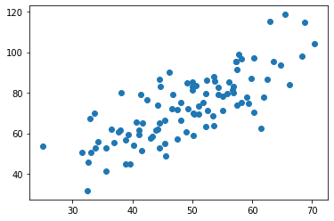
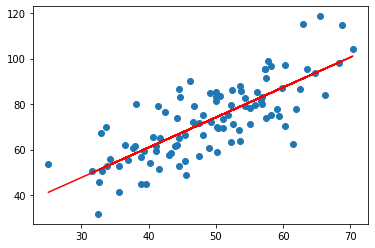

# 简单线性回归(最小二乘法)

## 0.引入依赖


```python
import numpy as np
import matplotlib.pyplot as plt
```

## 1.导入数据


```python
points = np.genfromtxt('data.csv',delimiter=',')
# points
# 提取csv x 和 y 
x = points[:,0]
y = points[:,1]
# 用plt 画出图
# 散点图
plt.scatter(x,y)
plt.show()
```


    

    


## 公式


## 2.定义损失函数


```python
# 损失函数式系数的函数 , 另外还要传入数据的x ,y
def compute_cost(w,b,points):
    total_cost = 0
    M = len(points)
    x = points[:,0]
    y = points[:,1]
    # 逐点计算偏差值 然后求平均数
    for i in range (M):
        total_cost += (y[i] - w * x[i] - b)**2
        
    return total_cost / M 

```

## 3. 定义损失函数


```python
# 先求一个平均数
def average(data):
    sum = 0 
    for i in data :
        sum+=i
    return sum / len(data)
# 定义拟合函数

def fit(points):
    x = points[:,0]
    y= points[:,1]
    M = len(points)
    x_bar = average(x)
    sum_xy = 0
    sum_xx = 0
    for i in range(M):
        sum_xy += y[i] * (x[i]-x_bar)
        sum_xx += x[i] ** 2
    w = sum_xy / (sum_xx - M * x_bar**2)
    b = 0
    for i in range(M):
        b+=(y[i] - w *x[i])
    b/=M
    return w,b 
```

## 测试


```python
w ,b = fit(points)
print("w is : ",w)
print("b is : ",b)
cost = compute_cost(w,b,points)
print("cost is : ",cost)

```

    w is :  1.3224310227553846
    b is :  7.991020982269173
    cost is :  110.25738346621313
    

## 5. 画出拟合函数


```python
plt.scatter(x,y)
# 针对每一个x，计算出预测的y值
pred_y = w * x + b

plt.plot(x , pred_y , c='r')
plt.show()

```


    

    


```python

```
